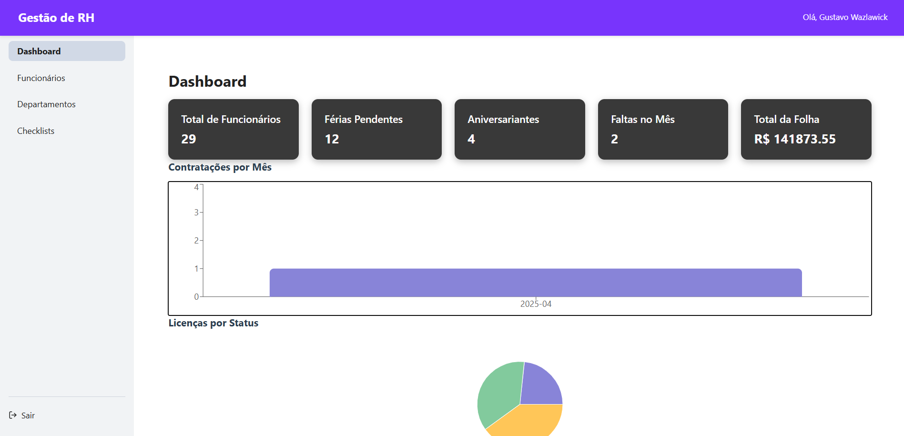

# EMMA - Employee Manager (Frontend)

**EMMA (Employee Manager)** é um sistema moderno de gestão de Recursos Humanos, com frontend em **React + Vite** e backend em **Laravel**. Este repositório contém o código do frontend, responsável pela interface e comunicação com a API.

---

## 📸 Demonstração

  

---

## ⚙️ Tecnologias Utilizadas

- [React 18](https://reactjs.org/)
- [Vite](https://vitejs.dev/)
- [TypeScript](https://www.typescriptlang.org/)
- [Axios](https://axios-http.com/)
- [React Router](https://reactrouter.com/)
- [Recharts](https://recharts.org/)
- [CSS Modules](https://github.com/css-modules/css-modules)
- [Google OAuth](https://developers.google.com/identity)
- Integração com backend Laravel + Sanctum (API REST)

---

## 🧠 Funcionalidades

- Login com Google OAuth2
- Controle de acesso por função (`admin`, `user`)
- Dashboard com estatísticas e gráficos
- Gerenciamento de Funcionários
- Visualização, edição e documentos (PDF)
- Gestão de Departamentos e Cargos
- Checklists personalizáveis e atribuídos
- Filtros de busca dinâmicos
- Interface 100% responsiva
- Gerenciamento de e-mails autorizados (admin)

---

## 🚀 Instalação

### Pré-requisitos

- Node.js 18+
- npm
- Composer
- php
- Backend Laravel rodando em `http://localhost:8000`


---

## ✅ Como Contribuir

1. Faça um fork do projeto
2. Crie uma nova branch: `git checkout -b feature/sua-funcionalidade`
3. Commit suas mudanças: `git commit -m 'feat: minha contribuição'`
4. Push para o repositório remoto: `git push origin feature/sua-funcionalidade`
5. Abra um Pull Request
---

## Passos
```bash
# Clone o repositório do frontend
git clone https://github.com/Heiquedev/PI_EMMA.git

# Clone o repositório do backend
git clone https://github.com/Figurantye/EMMA_back.git

# Acesse a pasta no frontend
cd Front

# Acesse a pasta no backend
cd emma

# Instale as dependências do frontend
npm install

# Instale as dependências do backend
composer install

# Crie as tabelas através do backend
php artisan migrate

# Inicie o servidor frontend
npm run dev

# Inicie o servidor backend
php artisan serve
```

## 📫 Autores

Desenvolvido por **Gustavo Wazlawick**, **Heique Rodrigues**, **Arthur Rodrigues**, **Henrique Oliveria**
Projeto acadêmico — Curso Técnico em Desenvolvimento de Software - Senac

